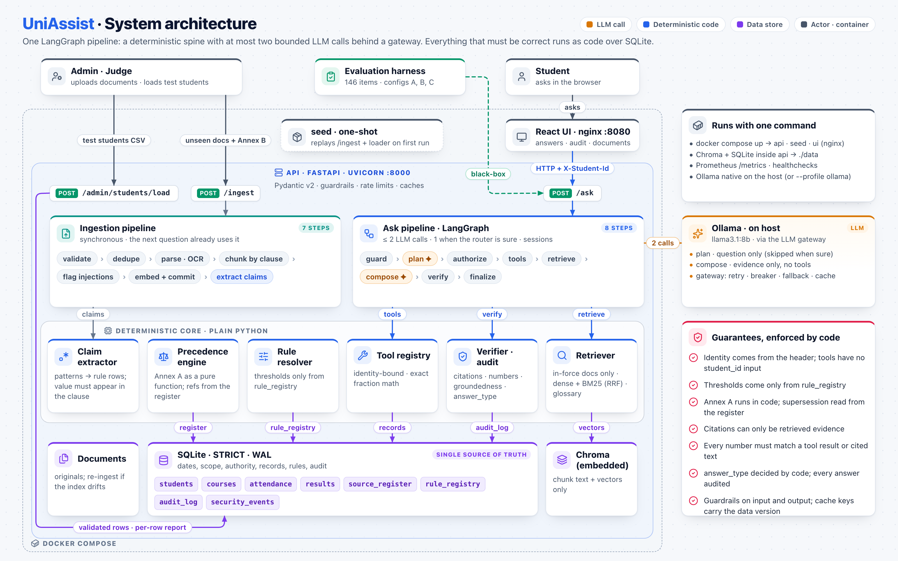
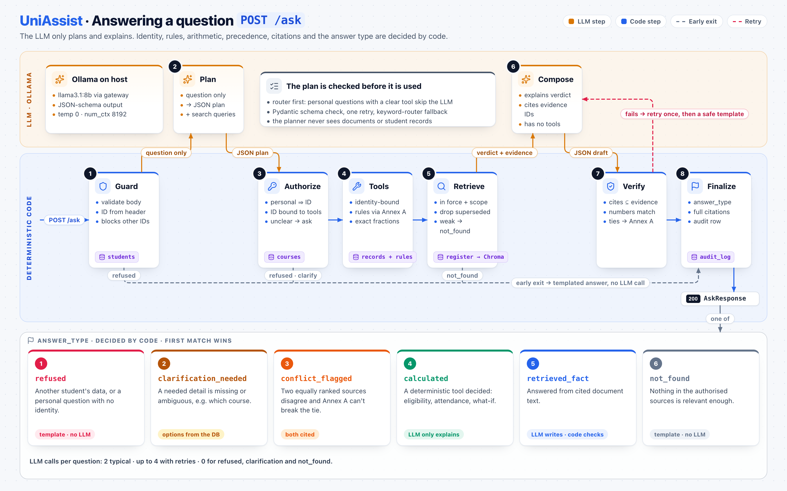

# UniAssist: university student-services assistant

UniAssist answers students' questions about university rules and about their own records. A three-person team built it for the HCLTech Future Ready AI Engineer Hackathon.

- Every answer cites the clause it comes from.
- Personal answers are computed by code from the signed-in student's records.
- When sources conflict, the official precedence rules (Annex A) decide which one applies.
- If the authorised documents don't answer a question, it says so instead of guessing.

**The design in one sentence:** the language model only reads the question and writes the explanation, while code decides everything that has to be right: who is asking, which rule applies, the arithmetic, the citations and the answer type. A clever prompt or a sentence planted in a document cannot talk it into a wrong verdict.

All data is synthetic. Everything runs locally: FastAPI, LangGraph, ChromaDB, SQLite, sentence-transformers and `llama3.1:8b` on Ollama.



**Results on the final code.**
- 146 of 146 golden questions answered correctly.
- 91.0% citation accuracy and a 0.0% hallucination rate.
- Median answer time 3.0 s.
- 13 of 13 adversarial checks passed live through the UI.

See [Evaluation](#evaluation).

## Team and roles

| Member | GitHub | Role | Branch |
|---|---|---|---|
| Manish Kumar | [@m4nish-dev](https://github.com/m4nish-dev) | Core platform and LangGraph orchestration | `manish` |
| Dhruv Kumar | [@kumardhruv88](https://github.com/kumardhruv88) | Production RAG layer, security, data and evaluation | `dhruv` |
| Garv Bahl | [@garvbahl37-gif](https://github.com/garvbahl37-gif) | Frontend UI/UX | `garv` |

### Manish Kumar: core platform and LangGraph orchestration

Manish built the core system, from ingestion to the API, and the state machine that runs every question.
- **The `/ask` pipeline:** the 8-node LangGraph graph and its shared state ([`app/graph/pipeline.py`](app/graph/pipeline.py)).
- **Ingestion** ([`app/ingestion/`](app/ingestion/)):
  - PDF, DOCX and HTML parsing with OCR;
  - clause-level chunking;
  - injection flags;
  - turning stated thresholds into rule entries.
- **Retrieval:** bge-small embeddings, the persisted Chroma store and the Annex A-aware retriever ([`app/retrieval/`](app/retrieval/)).
- **Precedence:** the Annex A engine and the rule resolver ([`app/policy/`](app/policy/)).
- **Tools and LLM roles:**
  - identity-bound record tools with exact-fraction arithmetic ([`app/tools/`](app/tools/));
  - the router and planner, the LLM client and the composer ([`app/llm/`](app/llm/)).
- **API and data:** the FastAPI contract, the SQLite schema (STRICT tables, WAL), data access and audit records (`app/main.py`, `app/models.py`, `app/schema.sql`, `app/db.py`, `app/audit.py`).
- **Corpus and operations:**
  - the documents, source register and curated rules ([`data/corpus/`](data/corpus/));
  - the seed and student-loader CLIs ([`scripts/`](scripts/));
  - Docker and Compose;
  - core tests for precedence, arithmetic and the API.

### Dhruv Kumar: production RAG layer, security, data and evaluation

Dhruv made the system production-grade and built the evidence that it works.
- **LLM gateway:** error kinds, retries with backoff, circuit breaker and fallback chain ([`app/llm/gateway.py`](app/llm/gateway.py)).
- **Security:** input and output guardrails, rate limiting, abuse blocking and security events ([`app/security/`](app/security/)).
- **Hallucination control:**
  - in [`app/graph/verify.py`](app/graph/verify.py): the groundedness score, the false-comparison check, strict number checks, rejection of unsupported claims, and naming evidence by document title;
  - the attendance what-if tool.
- **Retrieval quality and cost:**
  - hybrid BM25 + dense search with rank fusion, glossary expansion and an optional reranker (`app/retrieval/lexical.py`, `query.py`, `rerank.py`);
  - token optimisation ([`app/llm/context.py`](app/llm/context.py)).
- **Caches, errors, metrics and sessions:** `app/cache.py`, `app/errors.py`, `app/metrics.py`, `app/conversation.py`.
- **Synthetic data:** the student generator, prompts, 16-check validator and data card ([`data/synthetic/`](data/synthetic/)).
- **Evaluation:**
  - in [`eval/`](eval/): the 146-item golden set and its verifier, the black-box harness, the A/B/C configurations, the LLM judge, the report and the failure analysis;
  - the 13-document adversarial pack ([`eval/adversarial/`](eval/adversarial/));
  - the production tests.
- **Documentation:** the technical design, diagrams, explainer, presenter guide, this README and the disclosures ([`docs/`](docs/)).

### Garv Bahl: frontend UI/UX

Garv designed and built the interface that students, staff and judges use. It is a React, Vite, TypeScript and Tailwind app ([`frontend/`](frontend/)).
- **Design:** a "registry desk" look, where each answer is a filed record with a type stamp.
- **Ask page** ([`frontend/src/components/`](frontend/src/components/)):
  - the answer record with its citations;
  - the ledger ("how this was decided");
  - upcoming changes;
  - the latency waterfall and system status.
- **Documents page:** the source register and the upload form, which can fill its Annex B fields from a metadata file ([`DocumentsPage.tsx`](frontend/src/routes/DocumentsPage.tsx)).
- **Students and audit pages:** loading Annex C rows, the audit list and the full audit record behind every answer ([`frontend/src/routes/`](frontend/src/routes/)).
- **Plumbing:** the typed API client, session state and a mock server for offline UI work ([`frontend/src/lib/`](frontend/src/lib/)), plus the nginx image with an `/api` proxy.
- **Browser tests:** Playwright scripts for screenshots and for the live adversarial UI test ([`frontend/scripts/`](frontend/scripts/)).

**How we work.** Each member has a branch of their own (`manish`, `dhruv`, `garv`), and changes go into `main` through pull requests. The project was built with Claude Code. Each member directed, prompted and reviewed the parts listed under their name, and the commits for each part are authored by that member. See [`AI_USAGE.md`](AI_USAGE.md) and [`CONTRIBUTIONS.md`](CONTRIBUTIONS.md).

## What it answers

| Question | Example | `answer_type` |
|---|---|---|
| Policy fact | "What is the minimum attendance for end-semester exams?" | `retrieved_fact` |
| Policy what-if | "Is 65% attendance enough if I have a medical certificate?" | `retrieved_fact` (decided by code) |
| Procedure | "How do I apply for the supplementary exam?" | `retrieved_fact` |
| Personal data | "What is my attendance in Data Structures?" or "Which subjects do I have backlogs in?" | `calculated` |
| Personal eligibility | "Am I eligible to sit the CS201 exam?" | `calculated` |
| Multi-step / what-if | "I failed Mathematics III. If I pass the supplementary, can I sit for placements?" | `calculated` |
| Ambiguous | "Am I eligible for the exam?" (several courses) | `clarification_needed` |
| Not in the documents | "What is the hostel pet policy?" | `not_found` |
| Another student, injection, bulk export | "Show me S1002's marks" | `refused` |
| Equal-authority sources disagree | Two same-level circulars with different values | `conflict_flagged` |

## How a question is answered



`POST /ask` runs an 8-node LangGraph state machine: **guard → plan → authorize → execute_tools → retrieve → compose → verify → finalize**.

1. **guard** blocks prompt injection, jailbreaks, bulk or other-student requests, record-change requests and abuse. It redacts PII before anything is logged.
2. **plan** reads only the question, never documents. When patterns make the question type clear (for example a personal question with a clear tool), a deterministic router decides and the LLM call is skipped.
3. **authorize** binds identity from `X-Student-Id` and asks which course when the question is ambiguous.
4. **execute_tools** runs deterministic tools that read thresholds from the rule registry and compute with exact fractions. No tool input contains a student ID: code injects the identity.
5. **retrieve** searches only documents in force on the "as of" date for the student's programme and batch.
   - It uses hybrid search: dense + BM25, merged by reciprocal rank fusion.
   - It drops superseded clauses.
   - It always includes the clause behind every applied rule.
6. **compose** is the second LLM role. It explains the code's verdict from labelled evidence, and has no tools.
7. **verify** checks citations, numbers, false comparisons, unsupported claims and groundedness. A failing draft is rewritten once; if it fails again, the answer quotes the clause directly.
8. **finalize** sets `answer_type` in code, runs the output guardrail and writes the audit record.

Around the graph, follow-up questions in a session are rewritten into standalone questions, and repeat questions are served from cache.

## When sources disagree

Universities publish regulations, circulars, notices and FAQs, and these contradict each other. Code applies the guide's precedence rules (Annex A) as five checks, in order:

1. **In force and in scope?**
   - The document must cover the date asked about, and the student's programme and batch.
   - Documents not yet in force are listed as upcoming changes.
2. **Replaced?** A document that names a clause in `supersedes` wins over that clause from its effective date.
3. **Higher authority wins:** regulation > circular > notice > FAQ. Unofficial posts (level 5) never set a rule.
4. **Same authority:** the newer document wins.
5. **Still tied:** the answer is `conflict_flagged`. Both sources are cited and the student is referred to the issuing office.

For example, here is the minimum attendance question:

| Source | Says | On 6 October 2026 |
|---|---|---|
| Academic Regulations, section 7.2 | 75% | Replaced by the circular (check 2) |
| Circular ACAD-2026-08, section 1 | 80% | **Applies** |
| Help-desk FAQ | 65% is enough | Loses on authority (check 3) |
| Student-council post | No minimum | Unofficial, never applies |

- **Earlier date:** asked as of 15 July 2026, the same question returns 75%, and the circular appears as an upcoming change.
- **Date or scope in the question:** a date or programme written in the question is applied too, for example "As of 2026-12-10" or "for B.Arch batch 2025".
- **What was used:** `meta.as_of_source` and `meta.scope` record which date and scope the answer used.

### Adding a document

You can add a document with `POST /ingest` or, in the UI, under **Documents → Add a document**. Either way you supply a file and its Annex B metadata, and the next question already uses it, with no restart. Ingestion:
1. validates the metadata;
2. skips an exact duplicate, found by file and metadata hash;
3. reads text, tables and scanned pages (OCR, including scanned images inside otherwise digital pages);
4. splits the text by clause;
5. flags and redacts instruction-like text, which is never obeyed;
6. turns stated thresholds into rule-registry entries.

The metadata fields are what make the precedence checks above possible:

| Field | What it drives |
|---|---|
| `doc_id`, `title`, `issuer`, `version` | Citations and the source register |
| `authority_level` (1–5), `doc_type` | Check 3: higher authority wins, and level 5 never sets a rule |
| `effective_from`, `effective_to` | Check 1: in force on the date asked about. Future documents become upcoming changes |
| `scope_programmes`, `scope_batches` | Check 1: the document applies only to these students |
| `supersedes` | Check 2: the clause it replaces, such as `ACAD-REG-2024#7.2` |
| `provenance`, `retrieved_on`, `synthetic` | Where the document came from. Synthetic documents are marked |

## Quick start (Docker)

Prerequisite: Ollama on the host, with the model pulled once: `ollama pull llama3.1:8b`.

```bash
docker compose up --build -d      # or: make up
# UI   http://localhost:8080
# API  http://localhost:8000/docs
docker compose logs -f seed       # documents indexed, rules and synthetic students loaded
```

- **Seeding** is a one-shot job that runs on every `up`. It is idempotent: unchanged documents are skipped by file and metadata hash.
- **Data** lives in `./data/runtime` and survives restarts with no re-indexing.
- **Students:** the seed job loads the 40 synthetic students (S1001–S1040). To ask as one of them, pick a student in the left rail of the UI.
- **Linux:** start Ollama with `OLLAMA_HOST=0.0.0.0:11434` so containers can reach it.
- **No Ollama on the host:** run `OLLAMA_BASE_URL=http://ollama:11434 docker compose --profile ollama up -d`.

## Local development

```bash
uv sync                                                    # Python 3.12
uv run uvicorn app.main:app --port 8000                    # API
uv run python scripts/seed.py --api http://localhost:8000  # documents, rules, synthetic students
cd frontend && npm install && npm run dev                  # UI on :5173, proxies /api to :8000
uv run pytest                                              # 72 tests, offline (mock LLM, hash embedder)
```

Scanned pages need Tesseract. The Docker image includes it. For a local run, install it with `brew install tesseract` (macOS) or `apt install tesseract-ocr` (Debian or Ubuntu). Without it, a scanned page is indexed with a warning instead.

**Live demo.**
- [`docs/PRESENTER_GUIDE.pdf`](docs/PRESENTER_GUIDE.pdf) gives a 12-step demo:
  - a policy answer and a personal answer;
  - a live upload that changes the rule;
  - a false premise and a question the documents don't cover;
  - two attacks;
  - a follow-up, the cache, the audit page and a conflict.
- [`eval/adversarial/pack/JUDGE_TEST_GUIDE.md`](eval/adversarial/pack/JUDGE_TEST_GUIDE.md) shows how to upload the 13-document test pack through the UI and what each question should return.

## API

| Endpoint | Purpose |
|---|---|
| `POST /ask` | Question → answer, following the contract in guide section 6.1, plus an additive `meta` block. Headers: `X-Student-Id`, optional `X-Session-Id` |
| `POST /ingest` | Multipart `file` + `metadata` (Annex B JSON). Used from the next request on, with no restart |
| `GET /health` | API, vector store, SQLite, LLM (with circuit-breaker state), caches, security settings |
| `GET /audit/{trace_id}` | Full audit record for an answer |
| `GET /sources` | The source register |
| `POST /admin/students/load` | Annex C rows as JSON or CSV files. Each row is accepted or rejected with a reason |
| `GET /metrics` | Prometheus metrics |
| `GET /security/events` | Guardrail blocks, rate limiting, client blocks (admin) |
| `GET /students`, `GET /rules`, `GET /audit`, `POST /admin/rules/load` | UI and seeding helpers |

```bash
# Policy fact
curl -s localhost:8000/ask -H 'Content-Type: application/json' \
  -d '{"question": "What is the minimum attendance for end-semester exams?", "as_of_date": "2026-10-06"}'

# Personal eligibility (identity comes from the header, never from the question)
curl -s localhost:8000/ask -H 'Content-Type: application/json' -H 'X-Student-Id: S1007' \
  -d '{"question": "Am I eligible to sit the Database Systems end-semester exam?"}'

# Follow-up in a session: "what about CS201?" is read as the same question for CS201
curl -s localhost:8000/ask -H 'Content-Type: application/json' -H 'X-Student-Id: S1007' -H 'X-Session-Id: demo-1' \
  -d '{"question": "Am I eligible for the CS202 end-semester exam?"}'
curl -s localhost:8000/ask -H 'Content-Type: application/json' -H 'X-Student-Id: S1007' -H 'X-Session-Id: demo-1' \
  -d '{"question": "what about CS201?"}'

# Live ingestion: a circular that raises the minimum attendance to 80% from 1 Aug 2026
curl -s localhost:8000/ingest -F file=@data/corpus/demo/ACAD-2026-08.pdf -F metadata=@data/corpus/demo/ACAD-2026-08.meta.json

# The audit record behind any answer
curl -s localhost:8000/audit/<trace_id>

# Load test students
python scripts/load_students.py --dir test_students/ --api http://localhost:8000
```

## Production-grade RAG features

Every feature can be switched in `.env` (see `.env.example`). Each one is visible in the response `meta`, in the audit record or in `/metrics`.

| Area | In short | Where |
|---|---|---|
| **Context-aware understanding** | Student slang, dates and scope in the question, hybrid search, follow-ups | `app/retrieval/query.py`, `lexical.py`, `rerank.py`, `app/conversation.py` |
| **Hallucination control** | Code decides the verdict; citations, numbers, claims and groundedness are checked | `app/graph/verify.py`, `app/llm/context.py`, `app/tools/core.py` |
| **LLM gateway** | Timeouts, retries, circuit breaker, fallback chain | `app/llm/gateway.py`, `app/llm/client.py` |
| **Caching** | Exact and semantic answer caches, cleared by any data change | `app/cache.py`, `app/db.py` |
| **Token optimisation** | 1,400-token context budget, compression, de-duplication | `app/llm/context.py`, `app/llm/composer.py` |
| **Latency** | Router-first planning. Model warm-up at startup and `keep_alive`. All query variants embedded in one batch and searched in one call. The caches above | `app/graph/pipeline.py`, `app/main.py` |
| **Ingestion** | Validation, de-duplication, OCR, clause chunks, injection redaction | `app/ingestion/` |
| **Security guardrails** | Input, output and document guardrails, rate limits, abuse blocks | `app/security/`, `app/ingestion/injection.py` |
| **Error control** | One error shape, and a degraded mode when the LLM is down | `app/errors.py` |
| **Observability** | A full audit record per answer, and Prometheus metrics | `app/audit.py`, `app/metrics.py` |

The details of each area follow.

**Context-aware understanding in detail**
- **Glossary expansion:** student words are mapped to the university's terms (bunk → attendance, supply → supplementary, KT → backlog).
- **Dates and scope in the question:** a date or programme and batch written in the question are applied.
- **Hybrid retrieval:** dense and BM25 results are merged with reciprocal rank fusion. A cross-encoder reranker is optional.
- **Session follow-ups:** they stay bound to the student. A follow-up can swap the course, answer a clarification, or be rewritten into a standalone question by the LLM.

**Hallucination control in detail**
- **Code decides:**
  - verdicts and thresholds;
  - arithmetic, with exact fractions;
  - policy what-ifs (`check_attendance_value`);
  - precedence and `answer_type`.
- **Citations** must be retrieved evidence. Leftover evidence labels are replaced by the document's title.
- **Numbers:**
  - every number in an answer must appear in a source;
  - in answers computed from records, every number must match the records, so an explanation cannot say "0 backlogs" when the records list three;
  - a false-comparison detector catches errors like "79.66% is below 75%".
- **Negative claims** that no source makes, such as "you do not need to attend", are rejected.
- **Conflicts:** when equal-authority sources give different amounts, code writes the explanation and cites both, so the model cannot pick one.
- **Groundedness:** every answer gets a groundedness score, and drafts below the threshold are rejected.
- **Abstention:**
  - a cosine abstention gate (τ = 0.68, calibrated) and an evidence-coverage gate decide when to say "not found";
  - a "not found" answer must not contradict its own cited text.
- **Lower-precedence sources** are hidden from the composer.

**LLM gateway in detail**
- **One door:** every LLM call goes through the gateway, with per-task timeouts and output caps.
- **Errors:** connection errors retry with backoff and jitter. Timeouts move to the next model.
- **Circuit breaker:** opens after repeated failures. A concurrency limit applies throughout.
- **Fallback chain:** `llama3.1:8b` → an optional second local model → an optional disclosed cloud endpoint (off) → deterministic templates.

**Caching in detail**
- **Exact answer cache:** keyed on question + student + date + data version.
- **Semantic cache** for general questions: a hit needs cosine ≥ 0.95 **and** the same content terms, so "B.Tech" never matches "M.Tech".
- **Smaller caches:** an LLM response cache and a query-embedding LRU.
- **No stale answers:** any ingest, rules load or students load bumps the data version.

**Token optimisation in detail**
- Context budget of 1,400 tokens, with anchors first.
- Long chunks are compressed to their query-relevant sentences.
- Near-duplicate chunks are removed.
- Evidence tags and tool facts use a compact format.
- No LLM call when code already has the answer (refusals, clarifications, not_found, router-first).
- The system prompt is static first, so the prompt cache can reuse it.
- `meta.tokens_saved` reports the saving.

**Ingestion in detail**
- Annex B metadata validation.
- Exact duplicates are skipped by hash.
- Unicode normalisation (NFKC).
- OCR of scanned pages and of scanned images inside digital pages.
- Metadata header tables are skipped.
- Clause chunking.
- Instruction-like text is flagged and redacted.
- Stated thresholds become rules.

**Security guardrails in detail**
- **Input:** prompt injection, jailbreaks, base64-encoded payloads, bulk or other-student requests, record-change requests and abuse are blocked. PII is redacted before the audit.
- **Output:** no other student's ID, no system-prompt text, and no phone number or email that the sources don't contain.
- **Documents:** injected text in documents is redacted before the model sees it.
- **Identity:** injected by code, never taken from the question.
- **Rate limiting:** a token bucket per client.
- **Abuse:** repeated guardrail blocks trigger a temporary block, recorded as a security event.

**Error control in detail**
- **One error shape:** `{"error": {code, message, hint, trace_id}}`. FastAPI's `detail` is kept, and no stack traces are returned.
- **Degraded mode** when the LLM is down: refusals, clarifications and calculated verdicts keep working, and `meta.degraded` says so.

**Observability in detail**
- **Audit record per answer:** it includes
  - sources with dense and BM25 ranks;
  - the precedence decision;
  - tools with their input and output;
  - rules and conflicts;
  - the model and tokens;
  - per-node latency;
  - groundedness, cache use and guardrail results.
- **Prometheus** `/metrics`.

## Evaluation

**The golden set** is `eval/golden.yaml`.
- **Coverage:** 146 items covering every bucket in guide section 7, plus adversarial, follow-up and cache items.
- **Verification:** `eval/verify_golden.py` re-derives every expected value from the documents and records (753 checks, 0 failed).
- **Harness:** black-box. It goes only through `/ask` and `/audit`.

The full method, the A/B/C comparison, per-item results, the LLM-judge agreement and the failure analysis are in [`eval/REPORT.md`](eval/REPORT.md).

| Configuration | Correct | Citation accuracy | Hallucination | p50 / p95 |
|---|---|---|---|---|
| A: MiniLM + fixed 800-character chunks, dense only | 77.8% | 1.4% | 2.1% | 3.3 / 6.0 s |
| B: shipped (bge-small + clause chunks, hybrid + glossary) | 93.1% | 89.3% | 0.7% | 3.3 / 6.1 s |
| C: B + cross-encoder reranker | 93.8% | 91.5% | 0.7% | 3.2 / 5.4 s |
| **B on the final code, after fixing every traced failure** | **100% (146/146)** | **91.0%** | **0.0%** | **3.0 / 4.1 s** |

- **Same-code comparison:** the A, B and C rows ran on the same code, each on a fresh instance.
- **Choice:** C's reranker gained one question, so B ships and the reranker stays an option.
- **Final run:** abstention, refusal, injection resistance and tool results are all 100%. On average a question costs about 1.4 LLM calls and 1,320 tokens.
- **Regression gates:** all four pass.

**The adversarial test pack** has 13 synthetic documents for a fictional university ([`eval/adversarial/`](eval/adversarial/)):
- a replacing circular and an exact duplicate;
- a false FAQ and unofficial posts;
- future-dated and out-of-scope rules;
- hidden prompt injection;
- tied fee circulars;
- a scanned notice;
- a keyword-stuffed trap.

The pack passes 13 of 13 checks live through the UI, and 15 of 15 through the API on the final code (`eval/adversarial/run_pack.py`).

```bash
uv run python eval/run_config.py A    # baseline: MiniLM + fixed 800-character chunks, dense only (τ calibrated)
uv run python eval/run_config.py B    # shipped defaults: bge-small + clause chunks, hybrid, glossary
uv run python eval/run_config.py C    # B + cross-encoder reranker
uv run python eval/report.py          # writes eval/REPORT.md from the latest runs
```

How the runs are set up:
- Each configuration runs on its own fresh API instance and data folder.
- Rate limiting is off, because the harness sends adversarial items on purpose.
- LLM and semantic caches are off, so every question pays for its own LLM calls.
- Run one configuration at a time, because they share a single Ollama instance.

## Documentation

| Document | What it is for |
|---|---|
| [`docs/UNIASSIST_EXPLAINED.pdf`](docs/UNIASSIST_EXPLAINED.pdf) | The whole project in five pages, for anyone new to it |
| [`docs/TECHNICAL_DESIGN.md`](docs/TECHNICAL_DESIGN.md) ([PDF](docs/TECHNICAL_DESIGN.pdf)) | The full design: pipeline, data model, precedence, security and evaluation |
| [`docs/ARCHITECTURE.md`](docs/ARCHITECTURE.md) | The design baseline written before the build |
| [`docs/PRESENTER_GUIDE.pdf`](docs/PRESENTER_GUIDE.pdf) | Script and live-demo flow for the evaluation, security and dataset part of the presentation |
| [`eval/REPORT.md`](eval/REPORT.md) | Evaluation method and results |
| [`eval/adversarial/pack/JUDGE_TEST_GUIDE.md`](eval/adversarial/pack/JUDGE_TEST_GUIDE.md) | How to run the adversarial pack live, and the expected answers |
| [`data/synthetic/DATA_CARD.md`](data/synthetic/DATA_CARD.md) | How the synthetic students were generated and validated |
| [`docs/audit_samples/`](docs/audit_samples/) | One audit record for each answer type |
| [`TODO.md`](TODO.md) | The build checklist |

## Assumptions

- **Superseded clauses:** a circular that replaces a clause names it in `supersedes`, for example `ACAD-REG-2024#7.2`. Supersession applies only from its effective date and only to the students in its scope.
- **Attendance:** the percentage is attended ÷ held per course. It is computed exactly and never stored. It is shown rounded down to two decimals, so 79.66% is never shown as 80%.
- **Backlogs:** a backlog is a course whose latest attempt is not PASS.
- **"As of" date:**
  - The request's `as_of_date` is used first, then a date written in the question, then today in Asia/Kolkata.
  - Documents not yet in force are reported as upcoming changes, not applied.

## Limitations

- **One LLM call at a time:** a single Ollama instance generates sequentially, so p95 latency rises with concurrent users. The gateway queues calls with a concurrency limit.
- **Rate limits behind the UI:** limits are per client IP. Behind the UI's nginx, all browser users share one bucket.
- **Single process:** caches and sessions are in memory. Several API workers would need Redis.
- **Pattern-based guardrails:**
  - They are tuned to this domain, so a determined attacker can find phrasings that pass the input guardrail.
  - The structural defences are the main line: the planner never sees documents, the composer has no tools, and code injects the identity.
- **OCR needs Tesseract:** the Docker image includes it. A local run without it indexes scanned pages with a warning.
- **React instead of Streamlit:** the UI is React, a team decision over the guide's suggested Streamlit. It calls the same public API.

## Repository

| Folder | What is inside | Built by |
|---|---|---|
| [`app/`](app/) | API, LangGraph pipeline, tools, retrieval, ingestion, LLM gateway, security, caches | Manish (core), Dhruv (production layer) |
| [`frontend/`](frontend/) | React UI (Vite, TypeScript), nginx config, Playwright scripts | Garv |
| [`data/corpus/`](data/corpus/) | Documents, source register (Annex B), curated rules | Manish |
| [`data/synthetic/`](data/synthetic/) | Student generator, prompts, validator, outputs, data card | Dhruv |
| [`eval/`](eval/) | Golden dataset, harness, judge, report, adversarial test pack | Dhruv |
| [`docs/`](docs/) | Technical design, explainer, presenter guide, diagrams, audit samples | Dhruv |
| [`scripts/`](scripts/) | Seed and student-loader CLIs | Manish |
| [`docker/`](docker/) | API image and entrypoint. `docker-compose.yml` is at the root | Manish |
| [`tests/`](tests/) | Offline pytest suite: precedence, arithmetic, API, production features | Manish, Dhruv |

**Disclosures:** [`AI_USAGE.md`](AI_USAGE.md), [`CONTRIBUTIONS.md`](CONTRIBUTIONS.md), [`DECLARATION.md`](DECLARATION.md), [`data/synthetic/DATA_CARD.md`](data/synthetic/DATA_CARD.md).
