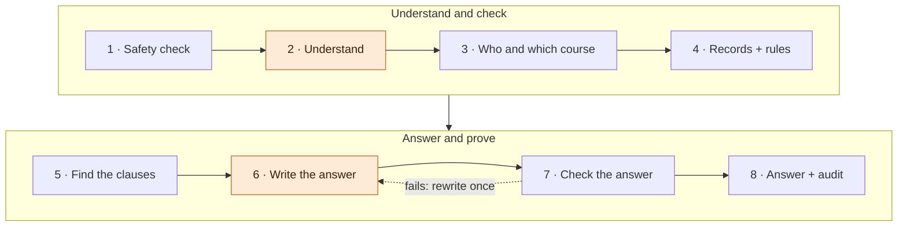
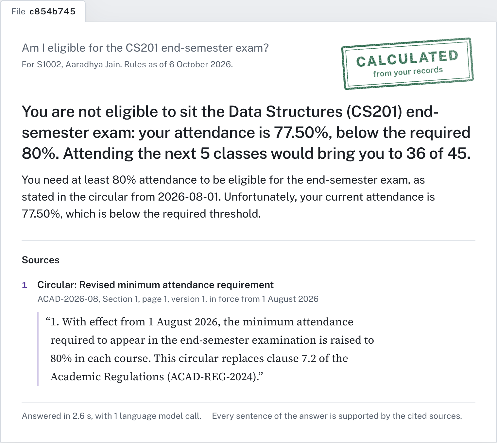
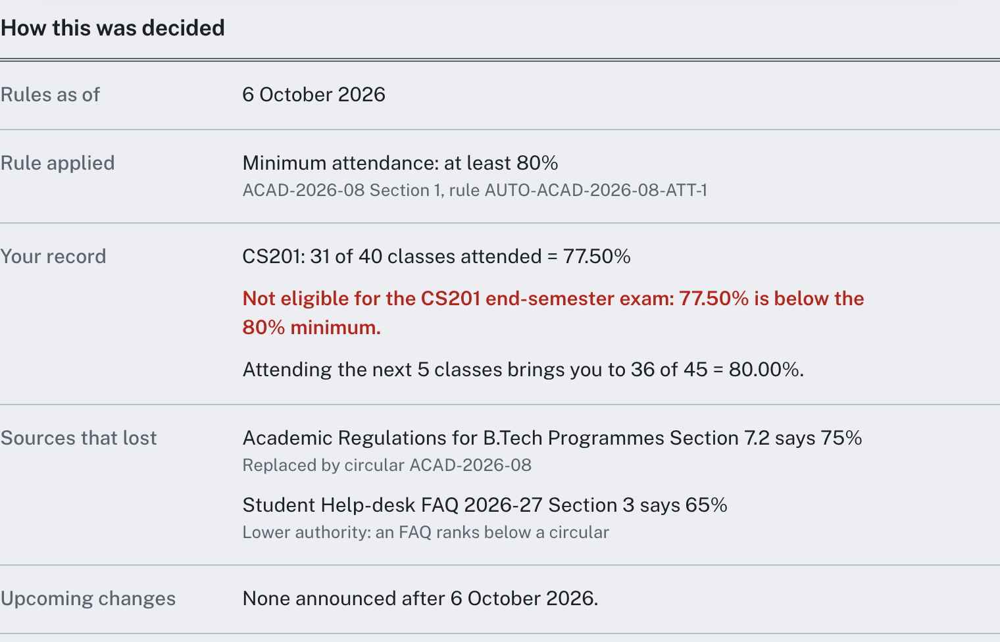
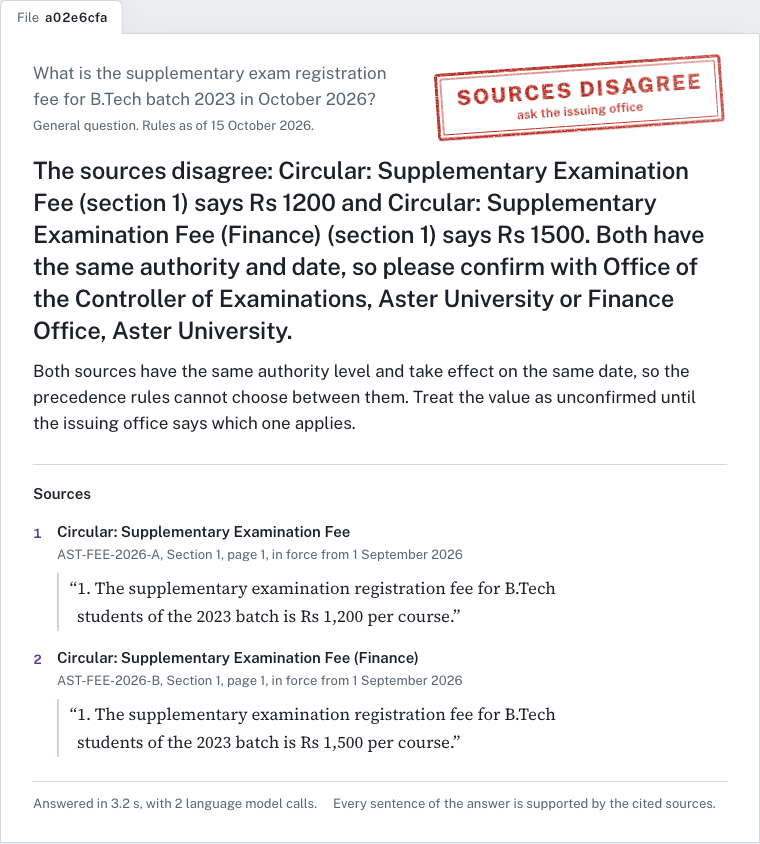

# UniAssist, explained

<style>table { break-inside: avoid; }</style>

**The whole project in five pages** · HCLTech Future Ready AI Engineer Hackathon · 6 October 2026

## 1. What UniAssist does

UniAssist answers students' questions about university rules and about their own records. Every answer:
- quotes the exact clause it comes from;
- carries a stamp saying what kind of answer it is;
- can be audited afterwards.

| A student asks | UniAssist answers | Stamp |
|---|---|---|
| What is the minimum attendance for end-semester exams? | 80%, quoting the circular that set it | As per rules |
| Am I eligible for the CS201 exam? | Not eligible: 77.50% is below 80%. Attend the next 5 classes. | Calculated |
| Is 65% enough if I have a medical certificate? | No: even with condonation the floor is 70% | As per rules |
| Which course? *(asked about "the exam")* | Lists the student's courses to pick from | Which one? |
| Show me S1002's marks | Refuses: you can only see your own records | Refused |
| Is there a scholarship for studying in Antarctica? | "I could not find this information in the authorised sources." | Not found |
| Two circulars give different fees | Shows both, cites both, asks you to confirm with the office | Sources disagree |

**The one idea behind it:** the AI model only understands the question and writes the explanation. Code decides everything that has to be right:
- who is asking;
- which rule applies;
- the arithmetic;
- the citations;
- the answer type.

A clever prompt or a planted sentence in a document therefore cannot talk it into a wrong verdict.

## 2. What happens when you ask a question



1. **Safety check.** Blocks prompt injection, attempts to change the assistant's role, requests for other students' data and abuse. Phone numbers and emails are removed before anything is logged.
2. **Understand** *(AI, often skipped)*. Works out what kind of question it is. When simple patterns already make it clear, code does this and the AI call is skipped.
3. **Who and which course.** The student comes from the sign-in, never from the question. If the question fits several courses, UniAssist asks which one.
4. **Records and rules.**
   - Exact maths over the student's records, such as 31 of 40 classes = 77.50%.
   - The threshold is read from the rule registry, never hard-coded.
5. **Find the clauses.**
   - Searches only documents in force on that date and for that programme, by meaning and by keyword together.
   - Replaced clauses are dropped.
6. **Write the answer** *(AI)*. The model explains the verdict using only the clauses it was given. It has no tools and cannot change the verdict.
7. **Check the answer.** Every citation must be a clause it was given and every number must appear in a source. If the check fails, the model rewrites once; if it fails again, UniAssist quotes the clause directly.
8. **Answer and audit.** Code stamps the answer type and saves an audit record: sources, rules, tools, model, tokens and timings.



*A personal answer. The verdict and the "next 5 classes" figure are computed by code; the model only wrote the explanation. The footer shows one AI call and that every sentence is supported by the cited source.*



*"How this was decided": the rule applied, the student's record, and why the 75% regulation and the 65% FAQ lost.*

## 3. When documents disagree

Universities publish regulations, circulars, notices and FAQs, and they contradict each other. UniAssist settles this with the guide's precedence rules (Annex A), applied by code in five checks:

1. **In force and in scope?** The document must cover the date asked about and the student's programme and batch. Future documents are shown as upcoming changes.
2. **Replaced?** A regulation or circular that says it replaces a clause wins over that clause.
3. **Higher authority wins:** regulation > circular > notice > FAQ. Unofficial posts never set a rule.
4. **Same authority:** the newer document wins.
5. **Still tied:** UniAssist says the sources disagree, cites both, and refers the student to the issuing office.

| Source | Says | On 6 October 2026 |
|---|---|---|
| Academic Regulations, section 7.2 | 75% | Replaced by the circular (check 2) |
| Circular ACAD-2026-08, section 1 | 80% | **Applies** |
| Help-desk FAQ | 65% is enough | Loses on authority (check 3) |
| Student-council post | No minimum | Unofficial, never applies |

Asked about 15 July 2026, the same question returns 75%, and the circular is listed as an upcoming change.

**Context comes from the question too.** UniAssist reads a date in the question ("As of 2026-12-10") and applies the rules in force then. "For B.Arch batch 2025" applies that programme's rules.



*Two circulars with the same authority and date give different fees. The answer cites both and makes no guess.*

**Adding a document** happens while the system runs; the next question already uses it. The steps:
- check its metadata;
- skip exact duplicates;
- read the text, tables and scanned pages (OCR);
- split it by clause;
- flag any hidden instructions;
- turn stated thresholds into rule entries.

## 4. Safe and honest by design

**Privacy and security**
- **Your own records only.** Identity comes only from the sign-in, and the record tools have no "student ID" input. Another student's ID or name in a question is refused.
- **Input checks.** Prompt injection, jailbreaks, hidden or encoded instructions, bulk-data requests ("which students have a CGPA below 6.5") and requests to change records are blocked and logged.
- **Output checks.** No other student's ID, no system-prompt text, and no phone number or email that the sources don't contain.
- **Documents are data.** Instructions hidden inside an uploaded document are flagged and redacted, and never obeyed.
- **Rate limits.** Repeated attacks get the client temporarily blocked, and every block is recorded as a security event.

**No made-up answers**
- **Exact arithmetic.** 79.66% is never rounded up to 80%.
- **Citations.** Only the clauses retrieved for the question can be cited.
- **Numbers.** Every number must appear in a source, and comparisons are checked ("79.66% is below 75%" is caught).
- **Groundedness score.** Every answer is checked against its sources; weak drafts are rewritten or replaced with a quote.
- **Abstention.** If nothing relevant is found, the answer is "not found" rather than a guess.
- **No false "yes".** Lower-authority sources are hidden from the AI writer, so it can't repeat the FAQ's "65% is enough".

**Fast and reliable**

| Technique | What it does |
|---|---|
| Code-first planning | Skips the planning AI call when patterns already tell the question type (about 1 s faster) |
| Caches | Repeat questions answer in milliseconds. Any new document or data load clears them, so an answer is never stale. Personal answers are never shared between students. |
| AI gateway | Retries, a circuit breaker and fallbacks. If the AI is down, rule, eligibility and refusal answers still work. |
| Token saving | Only the relevant sentences of each clause go to the AI, within a fixed budget, so it reads less and answers faster |
| Search | Meaning plus keywords, and student words mapped to official ones: "bunk" means attendance, "supply" means supplementary |
| Follow-ups | "What about CS202?" is understood from the previous question, for the same student only |

## 5. The proof: data, tests and results

**Synthetic data.** No real student data is used anywhere.
- **Students:** 40 synthetic students across 2 programmes and 2 batches, written by the local AI model and validated by 16 automated checks.
- **Edge cases:** 14 set exactly. Examples: attendance exactly at 75%, one class short, a fail by one mark, and the 79.66% rounding trap.
- **Data card:** the full description is in `data/synthetic/DATA_CARD.md`.

**Golden evaluation.**
- **The set:** 146 questions, each with the expected answer type, facts, sources and tool results.
- **The buckets:** policy, procedures, versions and conflicts, personal records, other-student attempts, multi-step, unanswerable, prompt injection, follow-ups and caching.
- **The method:** each configuration ran on a fresh copy of the system.

| Configuration (same code) | Correct | Citation accuracy | Hallucination | p50 / p95 time |
|---|---|---|---|---|
| A: simple baseline | 77.8% | 1.4% | 2.1% | 3.3 / 6.0 s |
| **B: shipped** | **93.1%** | **89.3%** | **0.7%** | 3.3 / 6.1 s |
| C: B + reranker | 93.8% | 91.5% | 0.7% | 3.2 / 5.4 s |

The evaluation traced each of B's failures to a cause, and every one was fixed. On the final code, B scores:
- **100% correct** (146 of 146, every bucket);
- citation accuracy 91.0% and a hallucination rate of 0.0%;
- about 1.4 AI calls per question, with a median answer time of 3.0 s.

C's reranker gained one question, so it stays an option, not the default.

**Adversarial test pack.** 13 synthetic documents for a fictional university:
- a baseline rule, a replacing circular and an exact duplicate;
- a false FAQ and unofficial posts;
- a future-dated rule and an out-of-scope programme;
- hidden prompt injection;
- tied fee circulars, a scanned notice and a keyword-stuffed trap.

All were uploaded through the real UI in a browser, and **13 of 13 checks passed live**. On top of that, 72 automated tests run offline.

## 6. Running it, and where things are

```bash
docker compose up --build -d        # UI http://localhost:8080 · API http://localhost:8000/docs
```

**Local development:** `uv sync`, then `uvicorn app.main:app`, then `python scripts/seed.py`. In `frontend/`, run `npm run dev`. The AI model is `llama3.1:8b`, running locally in Ollama, so nothing leaves the machine.

| Folder | What is inside |
|---|---|
| `app/` | The API, the 8-step LangGraph pipeline, tools, search, ingestion, AI gateway, guardrails, caches |
| `frontend/` | The React app: Ask, Documents, Students and Audit pages |
| `data/corpus/` | The university documents, the source register and the curated rules |
| `data/synthetic/` | The student data generator, prompts, validator and data card |
| `eval/` | The golden set, evaluation runner, AI judge, report and adversarial test pack |
| `docs/` | Technical design, diagrams, audit samples and this guide |

**Who directed what** (built with Claude Code, disclosed in `AI_USAGE.md`):
- **Manish Kumar:** the core build and its LangGraph orchestration.
- **Dhruv Kumar:** the production layer, data and evaluation.
- **Garv Bahl:** the frontend.
